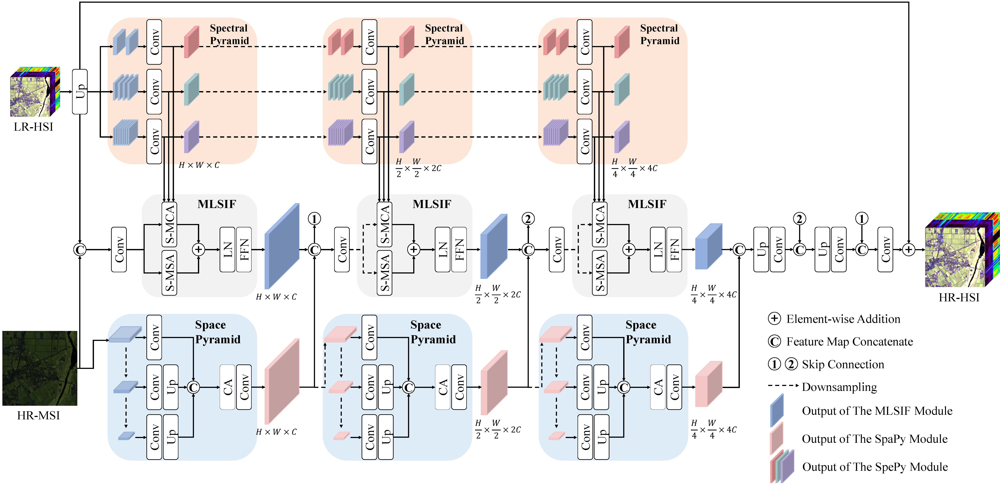

# DSPNet
Code of Dual Spatial–spectral Pyramid Network with Transformer for Hyperspectral Image Fusion

## Framework:


## To train:
1. Unzip Train.zip and Test.zip.
2. Put them in the "CAVE/Data" folder
3.
```python
python Train_DSP.py
```

## To test:
```python
python Test.py
```

## Tips:
### For training:
* [CAVE Dataset](https://pan.baidu.com/s/1CXCJfzp2yfvJZ9Lg2i-mNA) (extraction code: dju8)
* The pre-trained model is provided in the "CAVE/Checkpoint/f4/Model_DSP" folder.

## If this work is helpful to you, please cite it as:
```
@article{sun2023dual,
  title={Dual Spatial-spectral Pyramid Network with Transformer for Hyperspectral Image Fusion},
  author={Sun, Yucheng and Xu, Han and Ma, Yong and Wu, Minghui and Mei, Xiaoguang and Huang, Jun and Ma, Jiayi},
  journal={IEEE Transactions on Geoscience and Remote Sensing},
  year={2023},
  publisher={IEEE}
}
```

If you have any question, please email to me (ycsunner@gmail.com).
